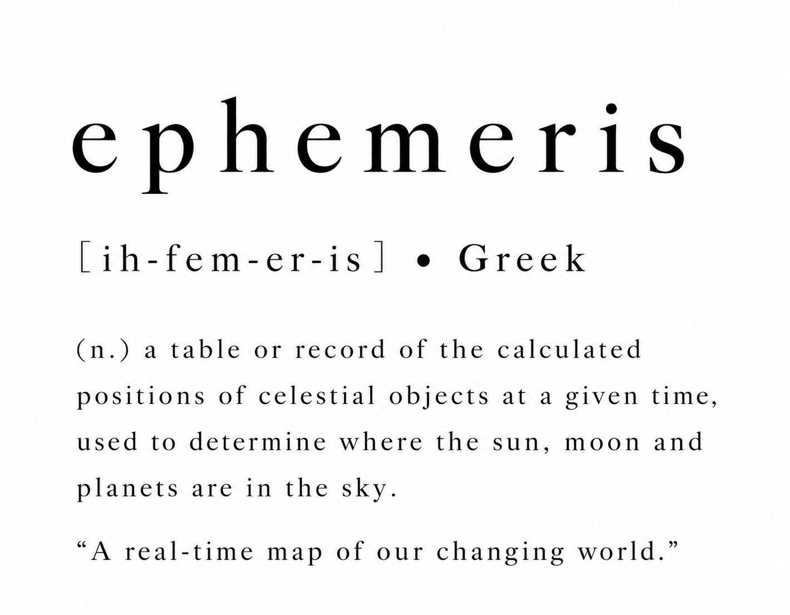

# ephemeris

a small windows screensaver written in rust. a quiet world map follows the sun, lights up cities after dark, and places recent news where it happens.

## why i built it

my father wanted an old windows screensaver he used to have, with a world map and news on it. i couldn't find it anymore, so i built him this one.

## what it does

- renders a flat world map with the live day/night boundary, soft twilight, and nasa city lights.
- locates news from nzz, bbc, and the new york times using an embedded gazetteer.
- groups reports about the same event across publishers and languages, showing the last 72 hours by default.
- cycles through featured events while idle; hover to explore a marker, or click to open an article. a key press or a click on the empty map exits.

## under the hood

the interesting part is turning a handful of news feeds into a readable map without making the screensaver heavy.

```text
rss feeds -> local cache -> geolocation -> deduplication -> ranked events
                                                               |
utc time -> solar position -> day/night map --------------------+-> screen
```

rust handles the news pipeline on one background thread. place names and aliases resolve locally; weighted text similarity and shared names or places help merge related reports. opengl 3.3 draws the map in one shader pass, with a separate batch for text and markers.

map data, lights, and fonts are embedded in a single `.scr` file. the renderer sleeps between updates and runs at roughly 30 fps during transitions. feeds refresh hourly by default, using conditional requests; there is no article scraping or runtime map download. the design targets a binary around 6 mb with low idle cpu and memory use.

## try it

on windows, download `ephemeris.scr` from a successful [build artifact](../../actions/workflows/build.yml), extract it, right-click it and choose install, then select ephemeris in screen saver settings. the settings button opens the config file, where you can choose topics, publishers, map centre, and timing.

for development, rust and an opengl 3.3 capable system are required. the windowed mode also runs on macos.

```sh
cargo run --release -- --window                 # run in a window
cargo run --release -- --screenshot out.png     # capture a frame
cargo run --release -- --dump-news              # inspect clustered events
cargo test                                    # run unit tests
```

## credits

map and place data: [natural earth](https://www.naturalearthdata.com/), public domain. night lights: nasa earth observatory, black marble 2016, public domain. typography: inter, under the sil open font license.

news comes from nzz, bbc, and the new york times rss feeds, with attribution and links to the originals. this project is for personal, non-commercial use; cached news expires after 72 hours by default.
